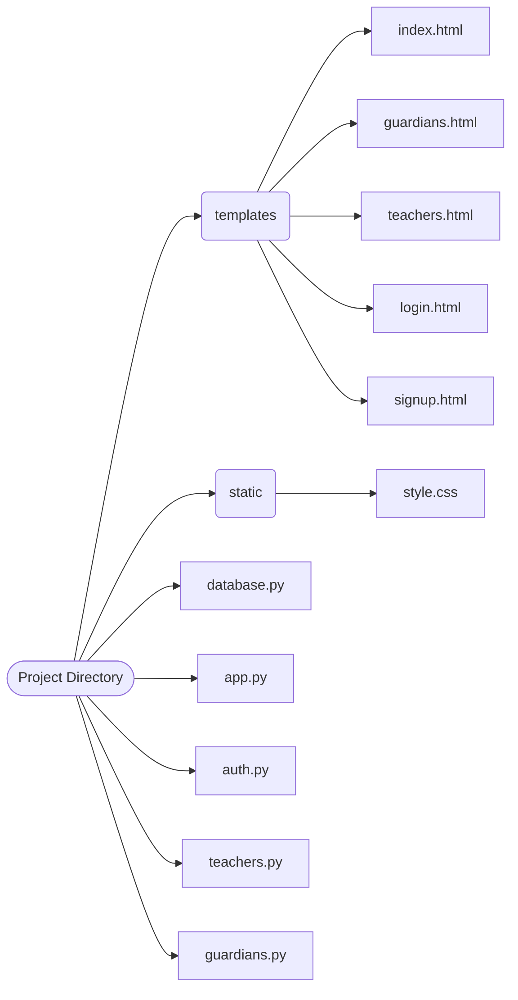
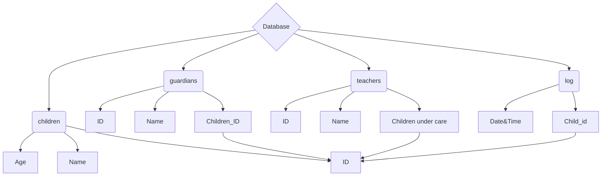
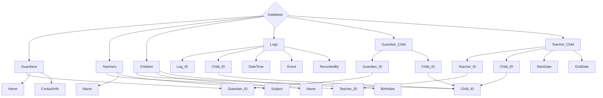

# File Structure

```mermaid
graph LR;

A([Project Directory])
A --> B(templates)
A --> C(static)
A --> A1[database.py]
A --> A2[app.py]
A --> A3[auth.py]
A --> A4[teachers.py]
A --> A5[guardians.py]

  
B --> B1[index.html]
B --> B2[guardians.html]
B --> B3[teachers.html]
B --> B4[login.html]
B --> B5[signup.html]

C --> C1[style.css]

```

# Database Structure

```mermaid
graph TB

A{Database}
A --> B(guardians)
A --> C(teachers)
A --> D(children)
A --> E(log)

B --> B1[ID]
B --> B2[Name]
B --> B3[Children_ID]
  
C --> C1[ID]
C --> C2[Name]
C --> C3[Children under care]

D --> D1[ID]
D --> D2[Name]
D --> D3[Age]

E --> E1[Date&Time]
E --> E2[Child_id]

B3 --> D1
C3 --> D1
E2 --> D1

```

```mermaid
flowchart TB

    A{Database}

    %% Core tables
    A --> B[Guardians]
    A --> C[Teachers]
    A --> D[Children]
    A --> E[Logs]
    A --> F[Guardian_Child]
    A --> G[Teacher_Child]

    %% Guardians
    B --> B1[Guardian_ID]
    B --> B2[Name]
    B --> B3[ContactInfo]

    %% Teachers
    C --> C1[Teacher_ID]
    C --> C2[Name]
    C --> C3[Subject]

    %% Children
    D --> D1[Child_ID]
    D --> D2[Name]
    D --> D3[Birthdate]

    %% Logs
    E --> E1[Log_ID]
    E --> E2[Child_ID]
    E --> E3[DateTime]
    E --> E4[Event]
    E --> E5[RecordedBy]

    %% Guardian_Child
    F --> F1[Guardian_ID]
    F --> F2[Child_ID]

    %% Teacher_Child
    G --> G1[Teacher_ID]
    G --> G2[Child_ID]
    G --> G3[StartDate]
    G --> G4[EndDate]

    %% Relationships
    F1 --> B1
    F2 --> D1

    G1 --> C1
    G2 --> D1

    E2 --> D1

```