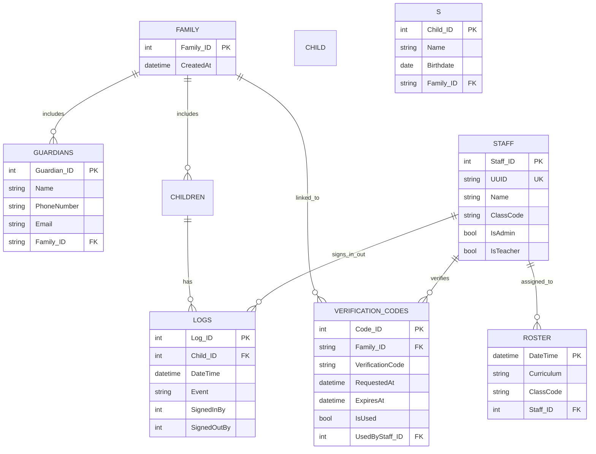
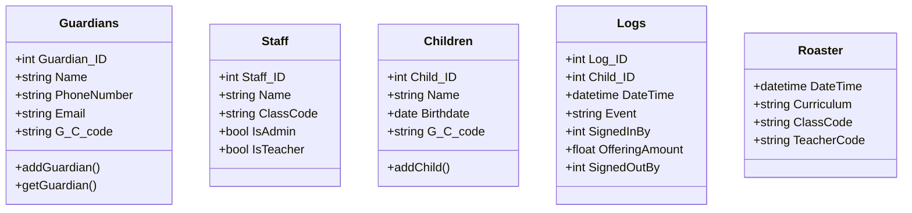

# File Structure

```mermaid
graph LR;

A([Project Directory])
A --> B(templates)
A --> C(static)
A --> A1[database.py]
A --> A2[app.py]
A --> A3[auth.py]
A --> A4[teachers.py]
A --> A5[guardians.py]

  
B --> B1[index.html]
B --> B2[guardians.html]
B --> B3[teachers.html]
B --> B4[login.html]
B --> B5[signup.html]
B --> B6[admin.html]

C --> C1[style.css]

```

# Database Structure

```mermaid
erDiagram
    FAMILY {
        int Family_ID PK
        datetime CreatedAt
    }

    GUARDIANS {
        int Guardian_ID PK
        string Name
        string PhoneNumber
        string Email
        string Family_ID FK
    }

    CHILD S {
        int Child_ID PK
        string Name
        date Birthdate
        string Family_ID FK
    }

    STAFF {
        int Staff_ID PK
        string UUID UK
        string Name
        string ClassCode
        bool IsAdmin
        bool IsTeacher
    }

    LOGS {
        int Log_ID PK
        int Child_ID FK
        datetime DateTime
        string Event
        int SignedInBy 
        int SignedOutBy
    }

    ROSTER {
        datetime DateTime PK
        string Curriculum
        string ClassCode
        int Staff_ID FK
    }

    VERIFICATION_CODES {
        int Code_ID PK
        string Family_ID FK
        string VerificationCode
        datetime RequestedAt
        datetime ExpiresAt
        bool IsUsed
        int UsedByStaff_ID FK
    }

    FAMILY ||--o{ GUARDIANS : includes
    FAMILY ||--o{ CHILDREN : includes
    FAMILY ||--o{ VERIFICATION_CODES : linked_to
    STAFF  ||--o{ VERIFICATION_CODES : verifies
    CHILDREN ||--o{ LOGS : has
    STAFF ||--o{ LOGS : signs_in_out
    STAFF ||--o{ ROSTER : assigned_to
```

```mermaid
classDiagram
    class Guardians {
        +int Guardian_ID
        +string Name
        +string PhoneNumber
        +string Email
        +string G_C_code
        +addGuardian()
        +getGuardian()

    }
    class Staff {
        +int Staff_ID
        +string Name
        +string ClassCode
        +bool IsAdmin
        +bool IsTeacher
    }
    
    class Children {
        +int Child_ID
        +string Name
        +date Birthdate
        +string G_C_code
        +addChild()
    }

    class Logs {
        +int Log_ID
        +int Child_ID
        +datetime DateTime
        +string Event
        +int SignedInBy
        +float OfferingAmount
        +int SignedOutBy
    }

    class Roaster {
        +datetime DateTime
        +string Curriculum
        +string ClassCode
        +string TeacherCode
    }

```
