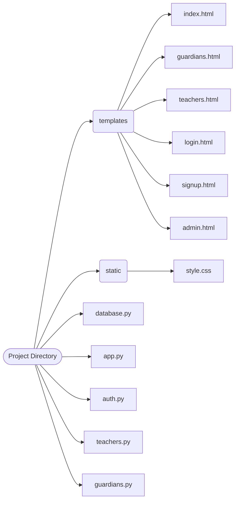
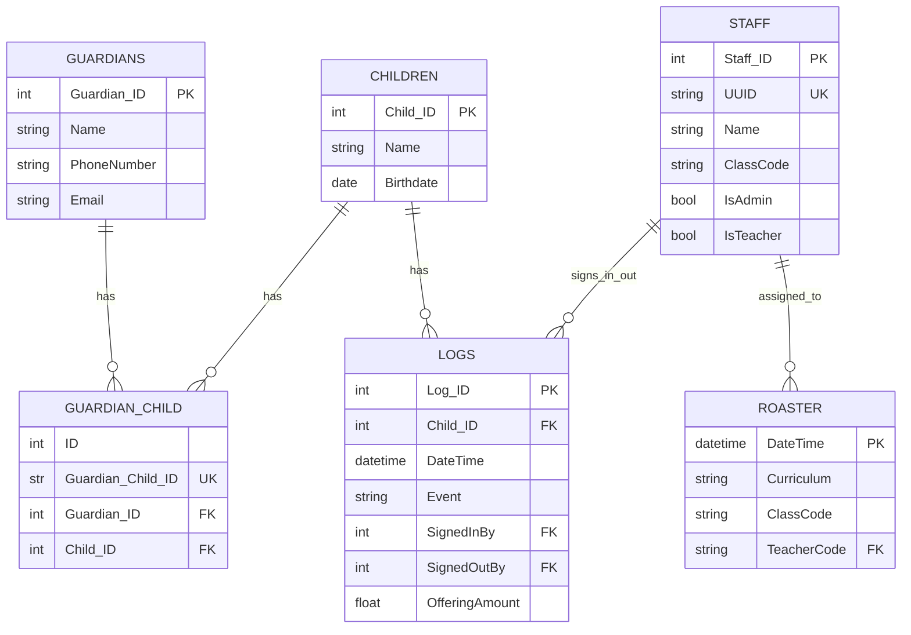
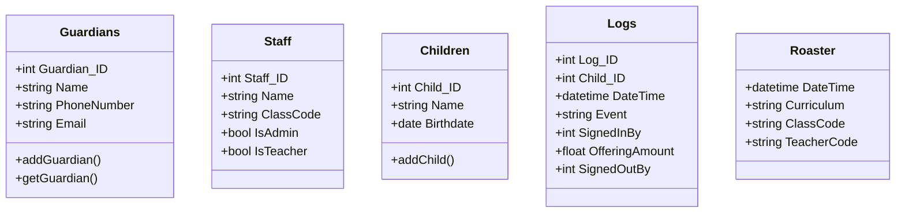

# File Structure

```mermaid
graph LR;

A([Project Directory])
A --> B(templates)
A --> C(static)
A --> A1[database.py]
A --> A2[app.py]
A --> A3[auth.py]
A --> A4[teachers.py]
A --> A5[guardians.py]

  
B --> B1[index.html]
B --> B2[guardians.html]
B --> B3[teachers.html]
B --> B4[login.html]
B --> B5[signup.html]
B --> B6[admin.html]

C --> C1[style.css]

```

# Database Structure

```mermaid
erDiagram
    GUARDIANS {
        int Guardian_ID PK
        string Name
        string PhoneNumber
        string Email
    }

    STAFF {
        int Staff_ID PK
        string UUID UK
        string Name
        string ClassCode
        bool IsAdmin
        bool IsTeacher
    }

    CHILDREN {
        int Child_ID PK
        string Name
        date Birthdate
    }

    LOGS {
        int Log_ID PK
        int Child_ID FK
        datetime DateTime
        string Event
        int SignedInBy FK
        int SignedOutBy FK
        float OfferingAmount
    }

    ROASTER {
        datetime DateTime PK
        string Curriculum
        string ClassCode
        string TeacherCode FK
    }

    GUARDIAN_CHILD {
        int ID
        str Guardian_Child_ID UK
        int Guardian_ID FK
        int Child_ID FK
    }

    GUARDIANS ||--o{ GUARDIAN_CHILD : has
    CHILDREN ||--o{ GUARDIAN_CHILD : has

    CHILDREN ||--o{ LOGS : has
    STAFF ||--o{ LOGS : signs_in_out

    STAFF ||--o{ ROASTER : assigned_to

```

```mermaid
classDiagram
    class Guardians {
        +int Guardian_ID
        +string Name
        +string PhoneNumber
        +string Email
        +addGuardian()
        +getGuardian()

    }
    class Staff {
        +int Staff_ID
        +string Name
        +string ClassCode
        +bool IsAdmin
        +bool IsTeacher
    }
    
    class Children {
        +int Child_ID
        +string Name
        +date Birthdate
        +addChild()
    }

    class Logs {
        +int Log_ID
        +int Child_ID
        +datetime DateTime
        +string Event
        +int SignedInBy
        +float OfferingAmount
        +int SignedOutBy
    }

    class Roaster {
        +datetime DateTime
        +string Curriculum
        +string ClassCode
        +string TeacherCode
    }

```
